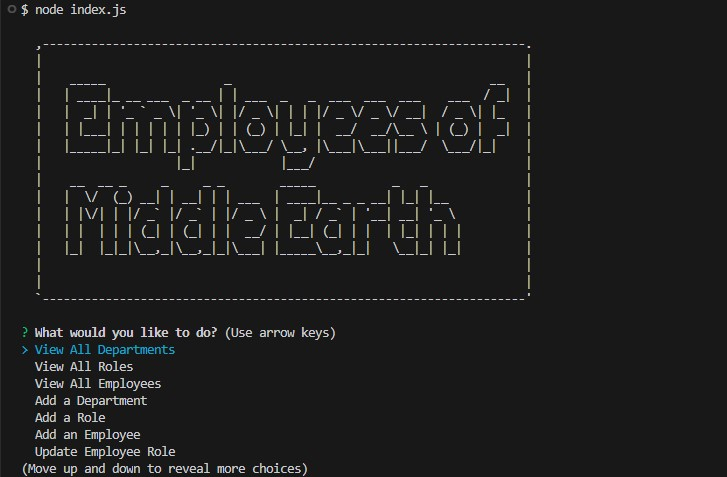
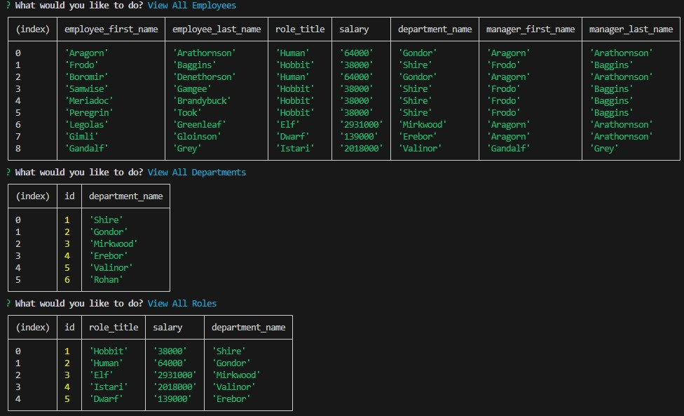

# Employee Tracker
  ## Description
  

  This application is a content management system. It utilizes Node.js, Inquirer, and PostgreSQL to manage a company's employee database. Opening the application in the command line, the user will be prompted a series of options to view, add, or delete departments, roles, or employees, as well as update an employee's role. Changes will be made to the database, then the results can be displayed in formatted tables in the command line. 

  Watch a video demonstration here: https://drive.google.com/file/d/19pvCs-z8CcpzPtOtMlYaW3lLp8jQ-J1G/view

  ## Table of Contents

  * [Installation](#installation)
  * [Usage](#usage)
  * [Credits](#credits)
  * [License](#license)
  * [Contributing](#contributing)
  * [Tests](#tests)
  * [Questions](#questions)

  ## Installation

  To install, clone repo to user's local files.

  ## Usage

Once repo is in local files, invoke node index.js in the command line, then respond to the prompts, as shown below.

  ## Credits

  I would like to thank my classmates, TAs, and tutors in the UCF Bootcamp for their advice and access to resources. 

  ## License

  
  This project is licensed under the MIT License.

  [License: MIT](https://opensource.org/licenses/MIT)

  ## Contributing

  If you would like to make any contributions, please make any changes in a branch and submit a pull request with detailed comments.

  ## Tests

  See Usage 

  ## Questions

  For more information, see my [GitHub](https://github.com/42Salokin)

  Send any questions or comments to nicholas.dpoul@gmail.com
